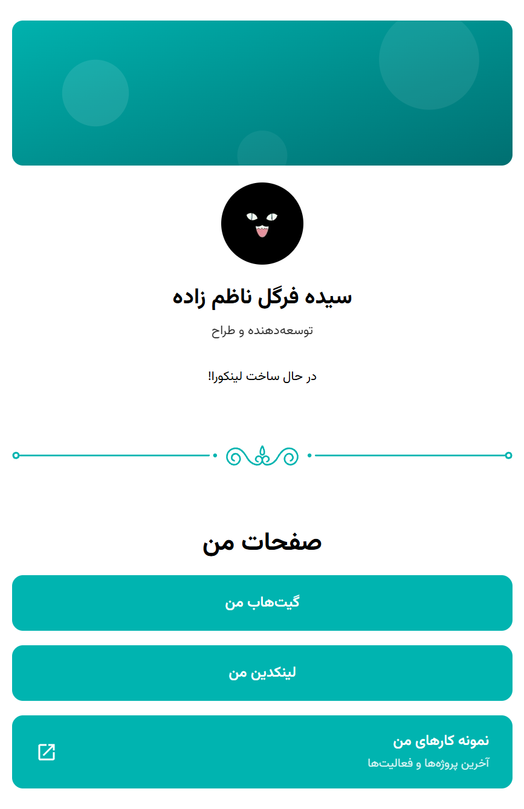
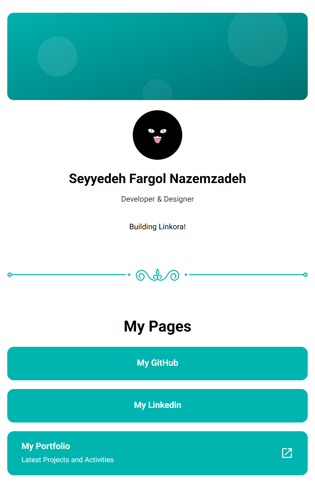
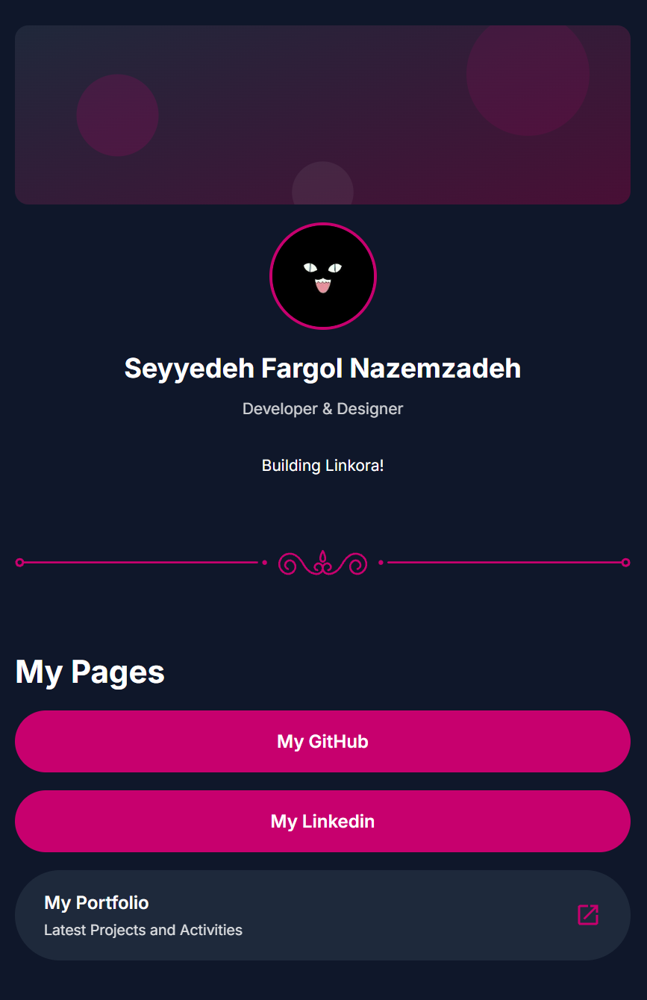

# Linkora

Linkora is a **Domain-Specific Language (DSL)** for creating customizable profile pages — similar to Link-in-Bio platforms such as Zlink, but with full bilingual (Persian/English) and RTL/LTR support baked in.

Instead of hand-writing HTML and CSS, you describe the structure and content of your page in a single `.lkr` source file. The Linkora compiler validates the file and generates a complete, self-contained, mobile-first static HTML page.

<p>
  <a href="https://fargolnz.github.io/Linkora/demo/Linkora-en">🚀 Live Demo</a>
</p>

A minimal end-to-end sample — a themed page with profile and one link:

```lkr
Theme {
    PageTheme { backgroundColor: "#1E293B", fontFamily: inter }
}

Profile {
    Name { title: "Seyyedeh Fargol Nazemzadeh", subtitle: "Developer" }
    Logo { image: "./assets/logo.jpg" }
    Bio { text: "Building cool stuff" }
}

Title { title: "My Links" }

Link { title: "GitHub", url: "https://github.com/Fargolnz" }
```

## 🌟 Showcase

*One language, three pages* — the same blocks rendered right-to-left in Persian, left-to-right in English, and restyled end-to-end by a dark theme.

| Persian (RTL, default theme) | English (LTR, default theme) | English (dark theme) |
|---|---|---|
|  |  |  |
| [`examples/Linkora-fa.lkr`](examples/Linkora-fa.lkr) ([live demo](https://fargolnz.github.io/Linkora/demo/Linkora-fa)) | [`examples/Linkora-en.lkr`](examples/Linkora-en.lkr) ([live demo](https://fargolnz.github.io/Linkora/demo/Linkora-en)) | [`examples/Linkora-en-themed.lkr`](examples/Linkora-en-themed.lkr) ([live demo](https://fargolnz.github.io/Linkora/demo/Linkora-en-themed)) |

## ✨ Features

### ✍️ Write
- Clean, human-readable declarative syntax — one `.lkr` file per page
- 17 documented content blocks: profile, links, grids, sliders, banners, video, FAQ, countdown, dividers and more
- Bilingual by design: Persian/English with automatic RTL/LTR layout

### 🎨 Design
- Powerful theming: page, per-block and per-item colors, shapes, fonts and backgrounds (solid colors and images)
- Brand icon library built in — including Iranian services (Bale, Eitaa, Rubika, Soroush Plus, Neshan, Balad)
- Interactive blocks with zero setup: image sliders, FAQ accordions, live countdowns

### ⚙️ Build
- Schema-driven validation with deterministic `Line:Column` error messages
- Single self-contained HTML file out (CSS embedded, assets copied alongside) — host it anywhere
- Tree-shaken CSS: only the styles your blocks need are emitted
- Easy to extend: adding a new block requires no grammar or parser changes


## 🚀 Quick start

### Requirements

- Python 3.10 or newer
- Java 11+ (only needed to regenerate the parser from the grammar)

### Installation

Create a virtual environment (optional but recommended) and install the runtime dependency:

```bash
python -m venv .venv
.venv\Scripts\activate        # Windows
source .venv/bin/activate     # macOS / Linux

pip install -r requirements.txt
```

For development (running the test suite), install the development dependencies instead:

```bash
pip install -r requirements-dev.txt
```

### Usage

Compile a Linkora source file into a static page:

```bash
python main.py <source.lkr>
```

By default the generated page is written to `output/index.html`. Use `--out` to choose a different directory:

```bash
python main.py examples\Linkora-fa.lkr --out my-site
```

Then open the generated file in a browser:

```bash
start output\index.html       # Windows
open output/index.html        # macOS
```

The output is a single self-contained HTML file with the CSS embedded, so it can be hosted anywhere or opened directly. To publish the sample pages for free with GitHub Pages, build them into a `docs/` folder and enable Pages from it in the repository settings.

### Exit codes

- `0` — compilation succeeded and the page was generated.
- `1` — compilation failed. All errors are printed to stderr in the format:

```
Semantic Error
Unknown property 'fontSize' inside block 'Link'.
Line 12, Column 5.
```

## 🔠 Language

A Linkora file (`.lkr`) is a sequence of top-level blocks. Each block is specified in [`docs/language/`](docs/language/): purpose, properties, defaults, examples and rules. If it's in the docs, it compiles.

| Block | Documentation |
|-------|---------------|
| `Page` | [`docs/language/Page.md`](docs/language/Page.md) |
| `Theme` | [`docs/language/Theme.md`](docs/language/Theme.md) |
| `Profile` | [`docs/language/Profile.md`](docs/language/Profile.md) |
| `Title` | [`docs/language/Title.md`](docs/language/Title.md) |
| `Text` | [`docs/language/Text.md`](docs/language/Text.md) |
| `Link` | [`docs/language/Link.md`](docs/language/Link.md) |
| `SuperLink` | [`docs/language/SuperLink.md`](docs/language/SuperLink.md) |
| `SocialMedia` | [`docs/language/SocialMedia.md`](docs/language/SocialMedia.md) |
| `SocialNetwork` | [`docs/language/SocialNetwork.md`](docs/language/SocialNetwork.md) |
| `Contact` | [`docs/language/Contact.md`](docs/language/Contact.md) |
| `Address` | [`docs/language/Address.md`](docs/language/Address.md) |
| `Image` | [`docs/language/Image.md`](docs/language/Image.md) |
| `Banner` | [`docs/language/Banner.md`](docs/language/Banner.md) |
| `Video` | [`docs/language/Video.md`](docs/language/Video.md) |
| `FAQ` | [`docs/language/FAQ.md`](docs/language/FAQ.md) |
| `Countdown` | [`docs/language/Countdown.md`](docs/language/Countdown.md) |
| `Divider` | [`docs/language/Divider.md`](docs/language/Divider.md) |

## 🎨 Theming

The `Theme` block restyles the whole page at once — background (color or image), fonts (any Google Fonts family, e.g. `inter` or `"Caveat"`) and per-block themes such as `LinkTheme` or `ImageTheme`:

```lkr
Theme {
    PageTheme { backgroundColor: "#1E293B", fontFamily: inter }
    LinkTheme { shape: pill }
}

Link { title: "GitHub", url: "https://github.com" }
Link { title: "Portfolio", url: "https://example.com" }
```

Both links render as pills on the dark page with no repeated styling. Any property can still be pinned per block or per item — explicit values always win over the theme:

```lkr
Link {
    title: "Contact Me"
    url: "https://example.com/contact"
    shape: sharp
    backgroundColor: "#C7006E"
}
```

This link keeps the page font and direction but opts out of the pill shape and background — everything else still follows the theme.

See [`docs/language/Theme.md`](docs/language/Theme.md) and the dark-theme sample `examples/sample-en-themed.lkr`.

## 🌍 Languages

`Page { language: fa }` (default) renders a right-to-left Persian page; `language: en` renders a left-to-right English page.

Direction, alignment defaults and date/calendar conventions follow the page language automatically.

See [`docs/language/Page.md`](docs/language/Page.md) for more information.

## 🧱 Project Structure

```
Linkora/
├── grammar/
│   └── Linkora.g4              # ANTLR4 grammar (lexer + parser)
│
├── tools/
│   └── generate_parser.bat     # Regenerates the parser (needs Java)
│
├── compiler/
│   ├── generated/              # ANTLR-generated parser (do not edit)
│   ├── codegen/
│   │   ├── html.py             # HTML generation
│   │   ├── css.py              # CSS generation
│   │   └── svg.py              # Brand + divider artwork
│   │
│   ├── ast.py                  # Intermediate representation
│   ├── build_ast.py            # Parse tree -> AST
│   ├── schema.py               # Block and property definitions (language spec)
│   ├── validator.py            # Semantic validation and defaults
│   ├── types.py                # Value predicates
│   ├── errors.py               # Error types
│   └── pipeline.py             # End-to-end compilation
│
├── docs/
│   ├── language/               # Block-by-block language reference
│   ├── demo/                   # Built sample pages, published via GitHub Pages
│   └── screenshots/            # Sample page screenshots
│
├── tests/                      # pytest suite
│   ├── test_parser.py
│   ├── test_semantics.py
│   ├── test_codegen.py
│   └── test_cli.py
│
├── examples/                   # Sample .lkr files and assets
├── main.py                     # Command-line interface
├── requirements.txt            # Runtime dependency
├── requirements-dev.txt        # Dev/test dependencies
└── pytest.ini                  # Test configuration
```

## 🛠️ Development

### Adding a new block

1. [`compiler/schema.py`](compiler/schema.py) — add the `BlockDef` with its `PropertyDef`s. This is the single source of truth: validation and error text follow automatically.
2. [`compiler/codegen/html.py`](compiler/codegen/html.py) — add `render_<block>` plus its dispatch-table entry; [`compiler/codegen/css.py`](compiler/codegen/css.py) — add the style group (emitted only when the block is used).
3. `docs/language/<Block>.md` — write the reference file; `tests/` — cover parsing, semantics and codegen.

### Running the tests

```bash
python -m pytest -q
```

- [`tests/test_parser.py`](tests/test_parser.py) — grammar and syntax
- [`tests/test_semantics.py`](tests/test_semantics.py) — validation, defaults and inheritance
- [`tests/test_codegen.py`](tests/test_codegen.py) — HTML/CSS output
- [`tests/test_cli.py`](tests/test_cli.py) — CLI behavior and exit codes

### Regenerating the parser

To regenerate the parser after changing [`grammar/Linkora.g4`](grammar/Linkora.g4) (requires Java):

```bash
tools\generate_parser.bat
```
